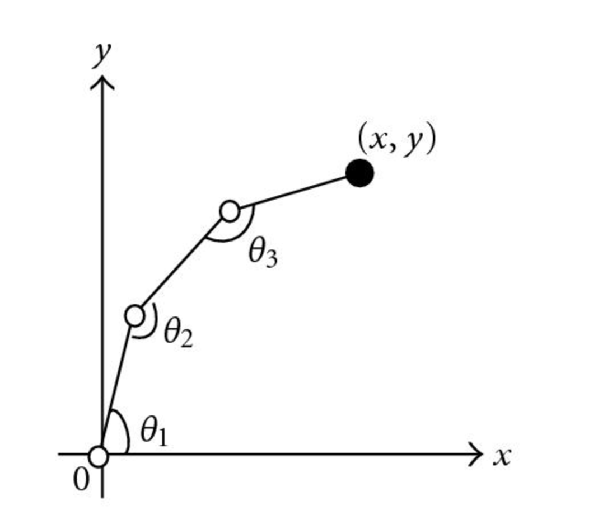
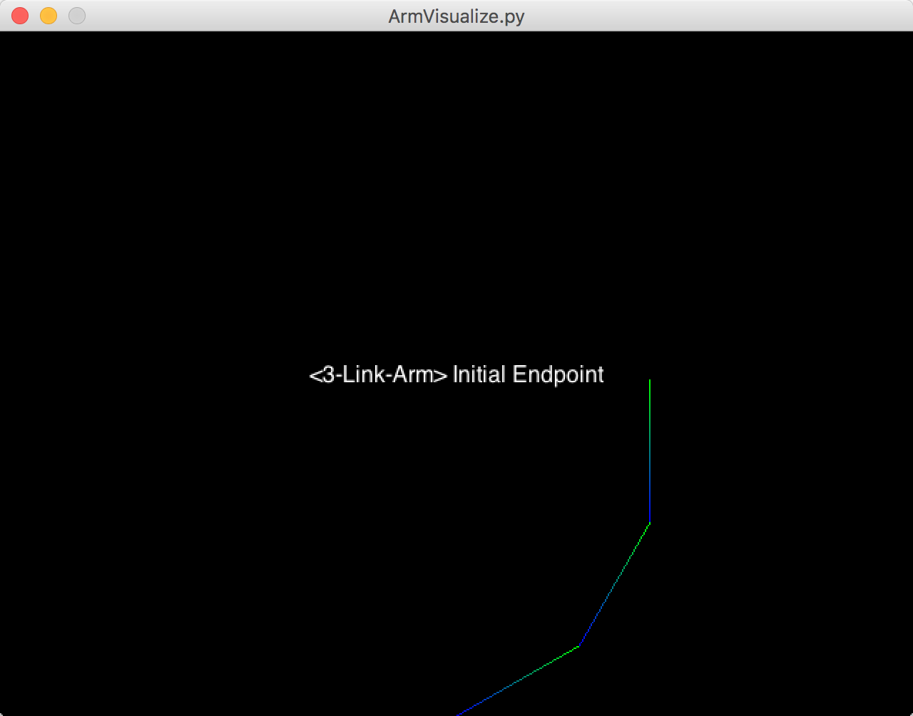
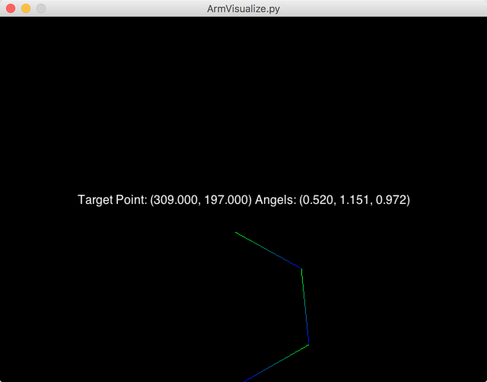

# LinkedArm3

## Installation

```
cd LinkedArm3/
```

Create python virtual environment

```
python3 -m venv venv
```

Activate virtual environment

```
. ./venv/bin/activate
```

Install packages

```
pip install requirements.txt
```

## Run evaluation code and visualization code

#### Evaluation script

```
python evaluation.py
```

You can change the code below in evaluation.py to set testing endpoint position range by setting x,y range.

Threshold of error capture is also changeable.

```
x = np.arange(340, 360, 5)
y = np.arange(150, 170, 5)
threshold = 0.0
```

#### Visualization function

```
python ArmVisualize.py
```

## Report

### Modeling

Mathematic model of a 3 DOF robotic arm on a 2D plane is drew as below:



According to the mathematic model, given three angels, the calculation of end point position's x and y value is (in ArmMC.py):

```
x = self.arm_length[0]*np.cos(joint_angle[0]) + \
    self.arm_length[1]*np.cos(joint_angle[0]+joint_angle[1]) + \
    self.arm_length[2]*np.cos(np.sum(joint_angle))

y = self.arm_length[0]*np.sin(joint_angle[0]) + \
    self.arm_length[1]*np.sin(joint_angle[0]+joint_angle[1]) + \
    self.arm_length[2]*np.sin(np.sum(joint_angle))
```

### Inverse Kinematics

Inverse kinematics makes use of the kinematics equations to determine the joint parameters that provide a desired position for each of the robot's end-effectors.

To evaluate predicted angels, in our situation, our gole would be finding joint angels that best achieves given end point position(x,y).

So our cost function a calculation of the difference/distance between the default joint state and our predicted joint state by using constrained minimization.

#### Analysis

Initially the weight of each joint moving priority is set equally, and the result is:

```
********* Trail #16 *********
Task:
  Initial joint angles [0.5235987755982988, 0.5235987755982988, 0.5235987755982988]
Result:
  Reached joint angles:  [-4.74040754  4.97027623  4.96426483]
Cost:
  Target endpoint position:  [355, 165]
  Actual endpoint position:  [146.50370836787476, 34.126919013818878]
Summary:
  Error:  [ 208.49629163  130.87308099]
Running time:  693.4010982513428 ms
------------------------------
```

After tried different settings, I found out with a lager weight set on wrist and elbow, better performance will achieve.

Which means a closer angel state the wrist and elbow stay a better result we will get, relatively. A sample evaluation of set weight to [1, 1.5, 2] is shown below:

```
********* Trail #16 *********
Task:
  Initial joint angles [0.5235987755982988, 0.5235987755982988, 0.5235987755982988]
Result:
  Reached joint angles:  [  6.01791777e-01  -4.38979900e-16   6.78507613e-09]
Cost:
  Target endpoint position:  [355, 165]
  Actual endpoint position:  [247.29677281881749, 169.83611557439184]
Summary:
  Error:  [ 107.70322718    4.83611557]
Running time:  427.16312408447266 ms
------------------------------
```

#### Visualization





##### References

http://www3.nd.edu/~jstiver/FIN360/Constrained%20Optimization.pdf

https://docs.scipy.org/doc/scipy-0.14.0/reference/generated/scipy.optimize.fmin_slsqp.html

https://pyglet.readthedocs.io/en/pyglet-1.2-maintenance/

http://www-clmc.usc.edu/publications/P/peters-IJRR2008.pdf